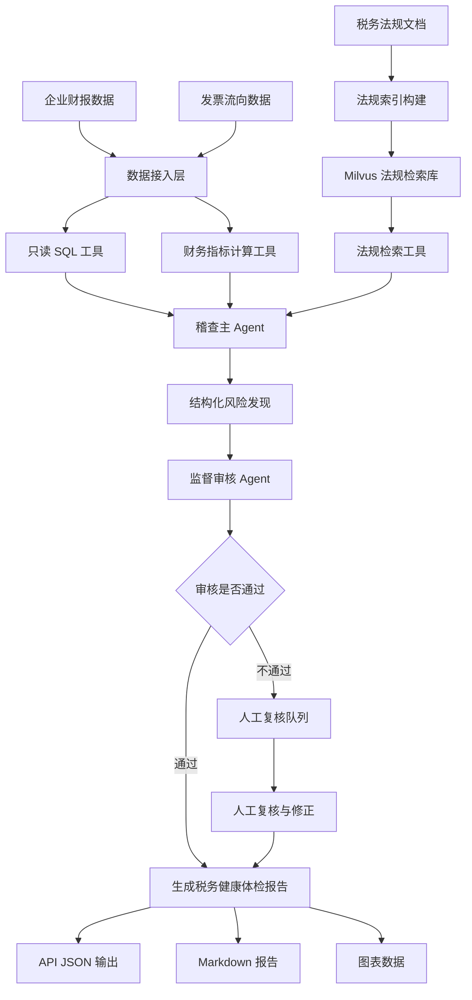
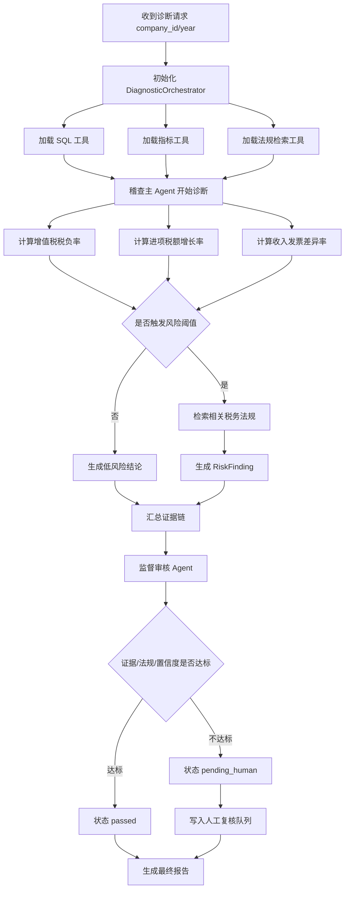
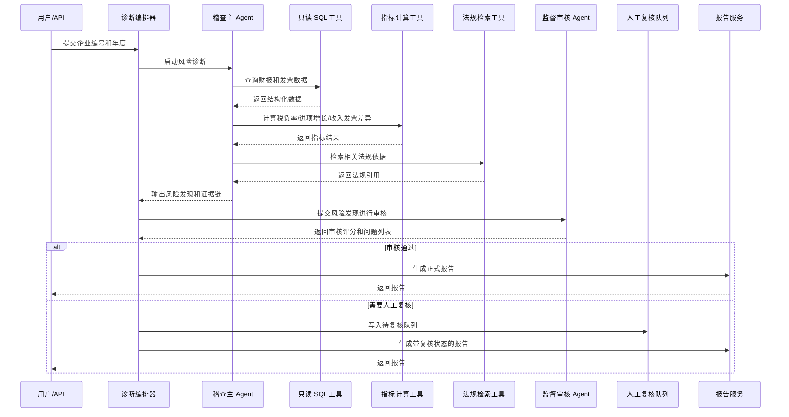
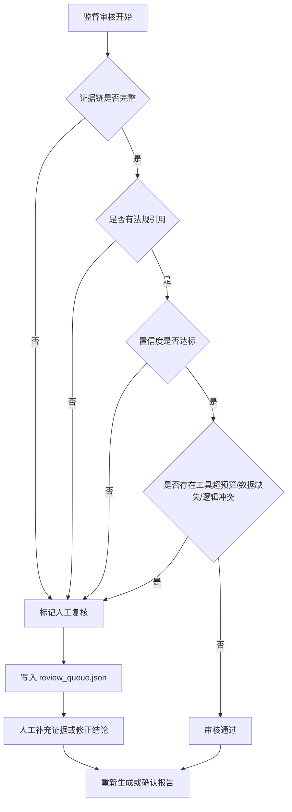
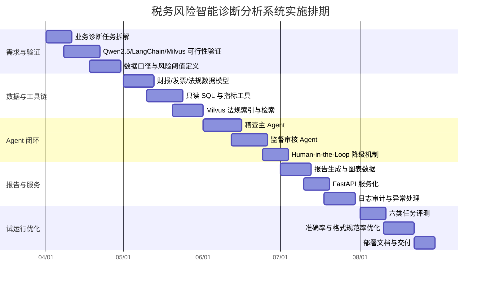

# 税务风险智能诊断分析系统：流程图

## 1. 总体架构流程图

```mermaid
flowchart TD
    A[企业财报数据] --> D[数据接入层]
    B[发票流向数据] --> D
    C[税务法规文档] --> E[法规索引构建]
    E --> F[Milvus 法规检索库]

    D --> G[只读 SQL 工具]
    D --> H[财务指标计算工具]
    F --> I[法规检索工具]

    G --> J[稽查主 Agent]
    H --> J
    I --> J

    J --> K[结构化风险发现]
    K --> L[监督审核 Agent]
    L --> M{审核是否通过}

    M -- 通过 --> N[生成税务健康体检报告]
    M -- 不通过 --> O[人工复核队列]
    O --> P[人工复核与修正]
    P --> N

    N --> Q[API JSON 输出]
    N --> R[Markdown 报告]
    N --> S[图表数据]
```

## 2. 诊断执行流程图

```mermaid
flowchart TD
    A[收到诊断请求 company_id/year] --> B[初始化 DiagnosticOrchestrator]
    B --> C[加载 SQL 工具]
    B --> D[加载指标工具]
    B --> E[加载法规检索工具]

    C --> F[稽查主 Agent 开始诊断]
    D --> F
    E --> F

    F --> G[计算增值税税负率]
    F --> H[计算进项税额增长率]
    F --> I[计算收入发票差异率]

    G --> J{是否触发风险阈值}
    H --> J
    I --> J

    J -- 是 --> K[检索相关税务法规]
    K --> L[生成 RiskFinding]

    J -- 否 --> M[生成低风险结论]
    M --> N[汇总证据链]
    L --> N

    N --> O[监督审核 Agent]
    O --> P{证据/法规/置信度是否达标}

    P -- 达标 --> Q[状态 passed]
    P -- 不达标 --> R[状态 pending_human]

    Q --> S[生成最终报告]
    R --> T[写入人工复核队列]
    T --> S
```

## 3. 双 Agent 协同流程图

```mermaid
sequenceDiagram
    participant User as 用户/API
    participant Orchestrator as 诊断编排器
    participant Inspector as 稽查主 Agent
    participant SQL as 只读 SQL 工具
    participant Metrics as 指标计算工具
    participant Rules as 法规检索工具
    participant Supervisor as 监督审核 Agent
    participant Review as 人工复核队列
    participant Report as 报告服务

    User->>Orchestrator: 提交企业编号和年度
    Orchestrator->>Inspector: 启动风险诊断
    Inspector->>SQL: 查询财报和发票数据
    SQL-->>Inspector: 返回结构化数据
    Inspector->>Metrics: 计算税负率/进项增长/收入发票差异
    Metrics-->>Inspector: 返回指标结果
    Inspector->>Rules: 检索相关法规依据
    Rules-->>Inspector: 返回法规引用
    Inspector-->>Orchestrator: 输出风险发现和证据链

    Orchestrator->>Supervisor: 提交风险发现进行审核
    Supervisor-->>Orchestrator: 返回审核评分和问题列表

    alt 审核通过
        Orchestrator->>Report: 生成正式报告
        Report-->>User: 返回报告
    else 需要人工复核
        Orchestrator->>Review: 写入待复核队列
        Orchestrator->>Report: 生成带复核状态的报告
        Report-->>User: 返回报告
    end
```

## 4. Human-in-the-Loop 降级流程图

```mermaid
flowchart TD
    A[监督审核开始] --> B{证据链是否完整}
    B -- 否 --> H[标记人工复核]
    B -- 是 --> C{是否有法规引用}

    C -- 否 --> H
    C -- 是 --> D{置信度是否达标}

    D -- 否 --> H
    D -- 是 --> E{是否存在工具超预算/数据缺失/逻辑冲突}

    E -- 是 --> H
    E -- 否 --> F[审核通过]

    H --> I[写入 review_queue.json]
    I --> J[人工补充证据或修正结论]
    J --> K[重新生成或确认报告]
    F --> K
```

## 5. 2025.04 - 2025.08 项目排期流程图

```mermaid
gantt
    title 税务风险智能诊断分析系统实施排期
    dateFormat  YYYY-MM-DD
    axisFormat  %m/%d

    section 需求与验证
    业务诊断任务拆解           :a1, 2025-04-01, 10d
    Qwen2.5/LangChain/Milvus 可行性验证 :a2, 2025-04-08, 14d
    数据口径与风险阈值定义       :a3, 2025-04-18, 12d

    section 数据与工具链
    财报/发票/法规数据模型       :b1, 2025-05-01, 12d
    只读 SQL 与指标工具          :b2, 2025-05-10, 14d
    Milvus 法规索引与检索         :b3, 2025-05-20, 12d

    section Agent 闭环
    稽查主 Agent                 :c1, 2025-06-01, 15d
    监督审核 Agent               :c2, 2025-06-12, 14d
    Human-in-the-Loop 降级机制    :c3, 2025-06-24, 10d

    section 报告与服务
    报告生成与图表数据            :d1, 2025-07-01, 12d
    FastAPI 服务化                :d2, 2025-07-10, 10d
    日志审计与异常处理            :d3, 2025-07-18, 12d

    section 试运行优化
    六类任务评测                  :e1, 2025-08-01, 10d
    准确率与格式规范率优化        :e2, 2025-08-10, 12d
    部署文档与交付                :e3, 2025-08-22, 8d
```

